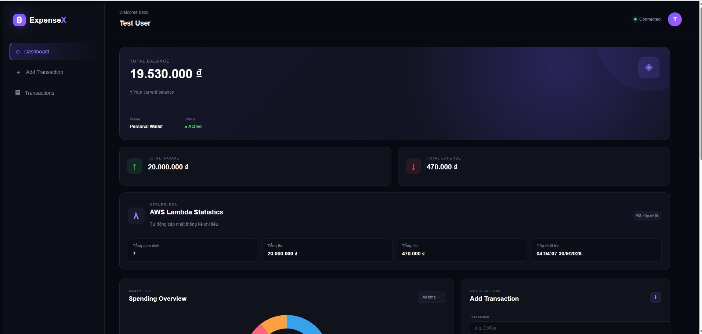

# Tổng quan Workshop

## Mục tiêu

Workshop hướng dẫn xây dựng một hệ thống **Expense Tracker – Quản lý chi tiêu** có khả năng quản lý tài khoản người dùng, quản lý giao dịch thu chi, thống kê dữ liệu và triển khai trên AWS.

Hệ thống được xây dựng theo quy trình từ môi trường local trước, sau đó triển khai lên AWS và bổ sung các chức năng xử lý serverless.

---

## 1. Giới thiệu bài toán

Expense Tracker là ứng dụng cho phép người dùng theo dõi các khoản thu nhập và chi tiêu cá nhân.

Mỗi người dùng có thể:

- Đăng ký tài khoản.
- Đăng nhập.
- Thêm giao dịch.
- Xem danh sách giao dịch.
- Chỉnh sửa giao dịch.
- Xóa giao dịch.
- Theo dõi tổng thu.
- Theo dõi tổng chi.
- Theo dõi số dư.
- Xem biểu đồ chi tiêu theo danh mục.

Dữ liệu của mỗi người dùng được phân biệt thông qua `userId`.

---

## 2. Kiến trúc hệ thống

```text
                         ┌──────────────────┐
                         │    EventBridge    │
                         │  Daily Scheduler  │
                         └────────┬─────────┘
                                  │
                                  ▼
┌──────────┐              ┌───────────────┐
│  Browser │              │ AWS Lambda    │
│   User   │              │ Statistics    │
└────┬─────┘              └───────┬───────┘
     │                            │
     ▼                            ▼
┌──────────┐              ┌────────────────┐
│   EC2    │─────────────►│ MongoDB Atlas  │
│ Node.js  │              │ expensetracker │
│ Express  │◄─────────────│                │
└────┬─────┘              └────────────────┘
     │
     ▼
┌──────────────┐
│   Dashboard  │
│   Chart.js   │
└──────────────┘

EC2 / Lambda → CloudWatch
```

<!-- IMAGE: Chèn ảnh kiến trúc Expense Tracker tại đây nếu có -->

---

## 3. Quy trình hoạt động

### Bước 1 – Người dùng truy cập hệ thống

Người dùng truy cập ứng dụng thông qua trình duyệt.

Website được phục vụ bởi ứng dụng Node.js chạy trên Amazon EC2.

### Bước 2 – Đăng ký và đăng nhập

Người dùng tạo tài khoản bằng email và mật khẩu.

Sau khi đăng nhập thành công, Backend tạo JWT Token.

Token được lưu ở phía Frontend và được gửi trong các request cần xác thực.

### Bước 3 – Quản lý giao dịch

Khi người dùng tạo giao dịch, Frontend gửi REST API request tới Backend.

Backend:

1. Kiểm tra JWT.
2. Xác định người dùng.
3. Lấy `userId`.
4. Lưu giao dịch vào MongoDB Atlas.

### Bước 4 – Dashboard

Frontend gọi API để lấy dữ liệu.

Backend truy vấn MongoDB Atlas và trả về:

- Tổng thu.
- Tổng chi.
- Số dư.
- Danh sách giao dịch.
- Thống kê theo danh mục.

Dashboard sử dụng Chart.js để hiển thị biểu đồ.


### Bước 5 – AWS Lambda

AWS Lambda được sử dụng để thực hiện thống kê dữ liệu.

Lambda kết nối MongoDB Atlas, xử lý dữ liệu theo từng người dùng và lưu kết quả vào collection `statistics`.

### Bước 6 – EventBridge

Amazon EventBridge Scheduler gọi Lambda theo lịch đã cấu hình.

Nhờ đó chức năng thống kê có thể được thực hiện tự động.

### Bước 7 – CloudWatch

CloudWatch được sử dụng để theo dõi log của Lambda và các hoạt động liên quan đến hệ thống.

---

## 4. Các dịch vụ AWS sử dụng

| Dịch vụ | Mục đích |
|---|---|
| Amazon EC2 | Chạy Backend Node.js |
| Amazon VPC | Xây dựng mạng AWS |
| Public Subnet | Đặt EC2 trong mạng public |
| Internet Gateway | Cho phép EC2 giao tiếp Internet |
| Security Group | Kiểm soát traffic tới EC2 |
| IAM | Quản lý quyền truy cập AWS |
| AWS Lambda | Xử lý thống kê |
| EventBridge | Lập lịch gọi Lambda |
| CloudWatch | Theo dõi log và hoạt động |

MongoDB Atlas được sử dụng làm cơ sở dữ liệu bên ngoài AWS.

---

## 5. Công nghệ sử dụng

- Node.js
- Express.js
- MongoDB Atlas
- Mongoose
- JWT
- bcrypt
- REST API
- HTML
- CSS
- JavaScript
- Chart.js
- PM2
- AWS Lambda

---

## 6. Kết quả đạt được

Sau khi hoàn thành Workshop:

- Ứng dụng hoạt động trên EC2.
- Người dùng có thể đăng ký và đăng nhập.
- JWT bảo vệ các API cần xác thực.
- Mỗi người dùng chỉ truy cập được dữ liệu của mình.
- Có đầy đủ chức năng CRUD giao dịch.
- Dashboard hiển thị thống kê.
- Lambda thực hiện thống kê tự động.
- EventBridge gọi Lambda theo lịch.
- CloudWatch lưu trữ log để theo dõi hệ thống.