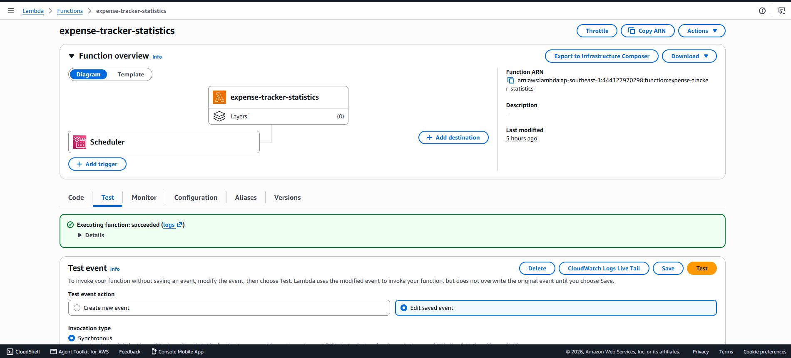
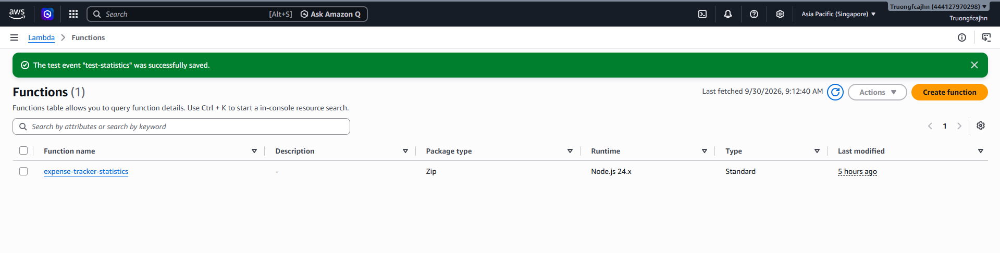
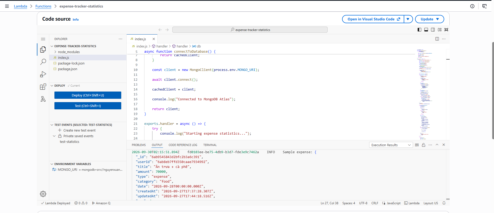
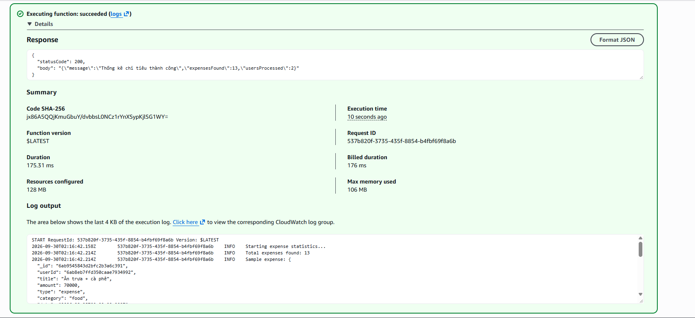

# Xây dựng AWS Lambda Statistics

## Mục tiêu

Tạo một Lambda function riêng để xử lý thống kê chi tiêu từ MongoDB Atlas.

---

## 1. Tạo thư mục Lambda

Trong project:

```text
expense-tracker/
├── backend/
├── frontend/
└── lambda-statistics/
```

Tạo thư mục:

```text
C:\Codes\expense-tracker\lambda-statistics
```

---

## 2. Khởi tạo project

```bash
cd C:\Codes\expense-tracker\lambda-statistics
npm init -y
```

Cài MongoDB driver:

```bash
npm install mongodb
```

---

## 3. Cấu trúc Lambda

```text
lambda-statistics/
├── index.js
├── package.json
├── package-lock.json
└── node_modules/
```

---

## 4. Tạo Lambda Function

Tên Function:

```text
expense-tracker-statistics
```

Runtime:

```text
Node.js
```

Handler:

```text
index.handler
```

---

## 5. Environment Variable

Lambda sử dụng:

```text
MONGO_URI=<MONGODB_CONNECTION_STRING>
```

Database:

```text
expensetracker
```

---

## 6. Luồng xử lý

```text
Lambda
   ↓
MongoDB Atlas
   ↓
Users
   ↓
Expenses
   ↓
Lọc theo userId
   ↓
Tính tổng thu / tổng chi
   ↓
Tính balance
   ↓
Lưu statistics
```

---

## 7. Kết quả Lambda

Test Lambda trả về:

```json
{
    "statusCode": 200,
    "body": "{\"message\":\"Thống kê chi tiêu thành công\",\"expensesFound\":16,\"usersProcessed\":2}"
}
```



---

## 8. Backend lấy dữ liệu Lambda

Backend cung cấp:

```text
GET http://localhost:3000/api/expenses/lambda-statistics
```

API lấy document mới nhất của User trong collection:

```text
statistics
```

---

## 9. Kết quả

Lambda được tách riêng khỏi Backend EC2 để thực hiện phần thống kê.

```text
EC2
 └── Backend API

Lambda
 └── Statistics

MongoDB Atlas
 ├── users
 ├── expenses
 └── statistics
```