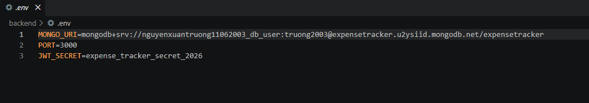
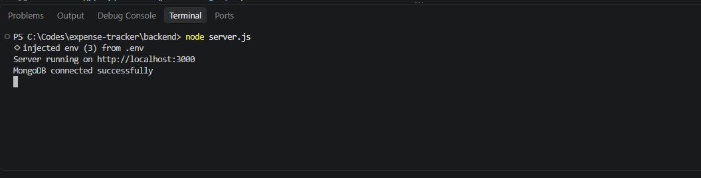
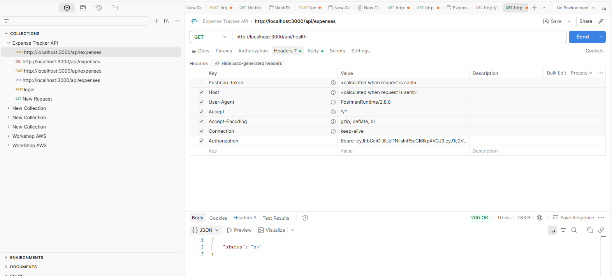

# Building the Backend and Connecting to MongoDB

## Objectives

Build the Backend using Node.js and Express, then connect the application to MongoDB Atlas.

---

## 1. Create the Backend

Create the following directory:

```text
C:\Codes\expense-tracker\backend
```

Initialize the Node.js project:

```bash
npm init -y
```

Install the required packages:

```bash
npm install express mongoose cors dotenv
```

---

## 2. Create the Server

File:

```text
backend/server.js
```

The main components include:

```javascript
const express = require("express");

const mongoose = require("mongoose");

const cors = require("cors");

require("dotenv").config();

const app = express();

app.use(cors());

app.use(express.json());

mongoose
    .connect(process.env.MONGO_URI)
    .then(() => {
        console.log("MongoDB connected successfully");
    })
    .catch((error) => {
        console.error("MongoDB connection error:", error);
    });

app.get("/api/health", (req, res) => {
    res.json({ status: "ok" });
});

const PORT = process.env.PORT || 3000;

app.listen(PORT, () => {
    console.log(`Server running on http://localhost:${PORT}`);
});
```

---

## 3. Configure MongoDB

Create the file:

```text
backend/.env
```

Content:

```text
MONGO_URI=<MONGODB_CONNECTION_STRING>

PORT=3000

JWT_SECRET=<SECRET>
```

The database used by the project is:

```text
expensetracker
```



> Do not commit the `.env` file to GitHub because it contains sensitive configuration such as the MongoDB connection string and JWT secret.

---

## 4. Run the Backend

Open a terminal in the Backend directory and run:

```bash
node server.js
```



Check the health endpoint:

```text
GET http://localhost:3000/api/health
```



Response:

```json
{
    "status": "ok"
}
```

---

## 5. Backend Structure

After the Backend is completed, the directory structure is:

```text
backend/

├── middleware/
│   └── authMiddleware.js

├── models/
│   ├── User.js
│   └── Expense.js

├── routes/
│   ├── authRoutes.js
│   └── expenseRoutes.js

├── .env
├── package.json
└── server.js
```

---

## 6. Result

The Backend runs on port `3000` and connects to MongoDB Atlas.

The Authentication and Expense APIs are implemented in the following steps.