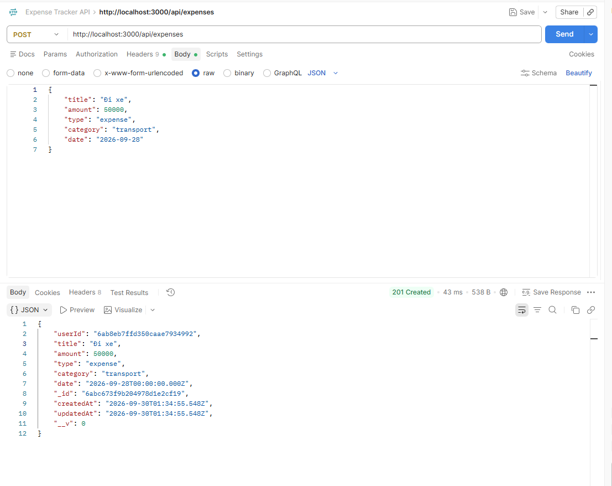

# Building Expense CRUD and Statistics

## Objectives

Create APIs for transaction management and statistics used by the Dashboard.

---

## 1. Expense Model

Create:

```text
backend/models/Expense.js
```

The Expense model contains the following fields:

```text
userId
title
amount
type
category
date
```

Example:

```json
{
    "title": "Bus",
    "amount": 50000,
    "type": "expense",
    "category": "Transport",
    "date": "2026-09-28"
}
```

---

## 2. Create Expense

Endpoint:

```text
POST http://localhost:3000/api/expenses
```

Header:

```text
Authorization: Bearer <TOKEN>
```

Request body example:

```json
{
    "title": "Bus",
    "amount": 50000,
    "type": "expense",
    "category": "Transport",
    "date": "2026-09-28"
}
```



The Backend verifies the JWT and automatically assigns the `userId` from the authenticated user.

---

## 3. Read Expenses

Get the list of transactions:

```text
GET http://localhost:3000/api/expenses
```

Header:

```text
Authorization: Bearer <TOKEN>
```

The Backend filters transactions by:

```text
userId
```

Therefore, each user can only retrieve their own transactions.

To retrieve a specific transaction:

```text
GET http://localhost:3000/api/expenses/:id
```

---

## 4. Update Expense

Endpoint:

```text
PUT http://localhost:3000/api/expenses/:id
```

Header:

```text
Authorization: Bearer <TOKEN>
```

The Backend finds the transaction using:

```text
_id
userId
```

The transaction is then updated with the new data.

---

## 5. Delete Expense

Endpoint:

```text
DELETE http://localhost:3000/api/expenses/:id
```

Header:

```text
Authorization: Bearer <TOKEN>
```

Only a transaction belonging to the authenticated user can be deleted.

---

## 6. Expense Summary

Endpoint:

```text
GET http://localhost:3000/api/expenses/summary
```

Header:

```text
Authorization: Bearer <TOKEN>
```

Example response:

```json
{
    "totalIncome": 10000000,
    "totalExpense": 2000000,
    "balance": 8000000,
    "totalTransactions": 10
}
```

The balance is calculated using:

```text
balance = totalIncome - totalExpense
```

The summary data is used to display the financial information on the Dashboard.

---

## 7. Category Statistics

Endpoint:

```text
GET http://localhost:3000/api/expenses/summary/category
```

Header:

```text
Authorization: Bearer <TOKEN>
```

The data is aggregated by `category`.

Example:

```json
[
    {
        "category": "Food",
        "total": 1500000
    },
    {
        "category": "Transport",
        "total": 500000
    }
]
```

This data is used to generate the expense category chart on the Dashboard.

---

## 8. Lambda Statistics

After AWS Lambda is deployed, the Backend provides the following endpoint:

```text
GET http://localhost:3000/api/expenses/lambda-statistics
```

Header:

```text
Authorization: Bearer <TOKEN>
```

The API retrieves the latest statistics from the following MongoDB collection:

```text
statistics
```

The statistics are generated by the AWS Lambda function and associated with the corresponding user.

---

## 9. Expense API Summary

The main Expense Tracker APIs are:

```text
POST   /api/expenses
GET    /api/expenses
GET    /api/expenses/:id
PUT    /api/expenses/:id
DELETE /api/expenses/:id

GET    /api/expenses/summary
GET    /api/expenses/summary/category
GET    /api/expenses/lambda-statistics
```

All Expense APIs that require authentication use:

```text
Authorization: Bearer <TOKEN>
```

---

## 10. Result

The Expense Tracker Backend provides:

- Create expense transactions.
- Retrieve all transactions for the authenticated user.
- Retrieve a specific transaction.
- Update transactions.
- Delete transactions.
- Calculate total income.
- Calculate total expenses.
- Calculate the current balance.
- Generate statistics by category.
- Retrieve statistics generated by AWS Lambda.

The Expense data is stored in MongoDB Atlas and associated with each user through `userId`.