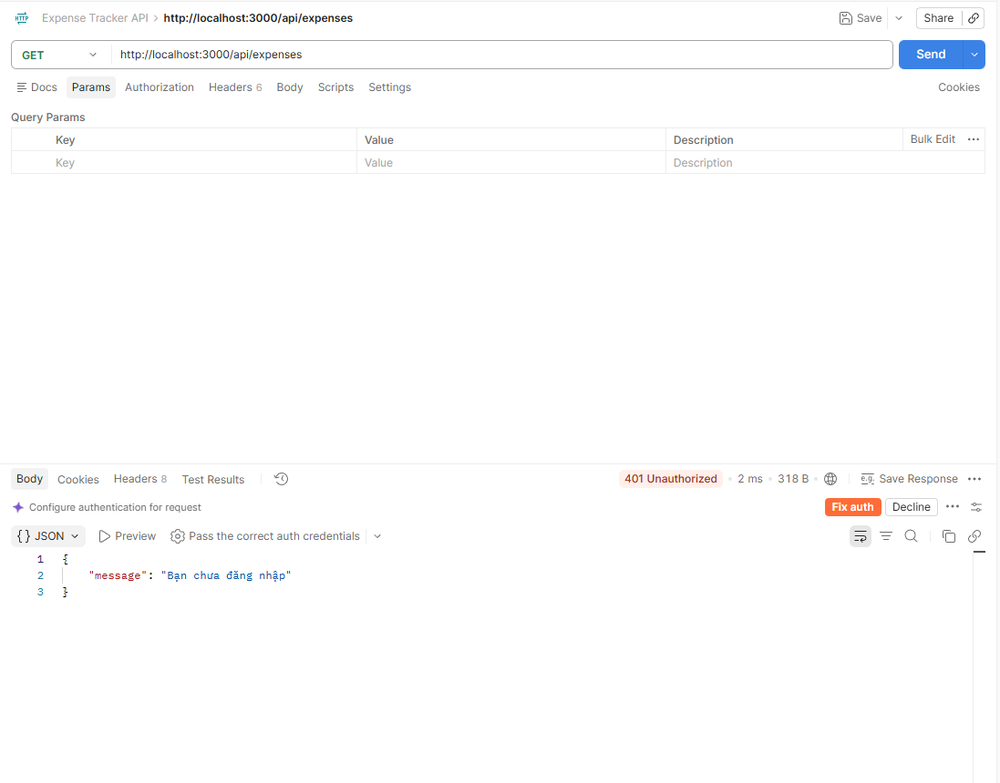
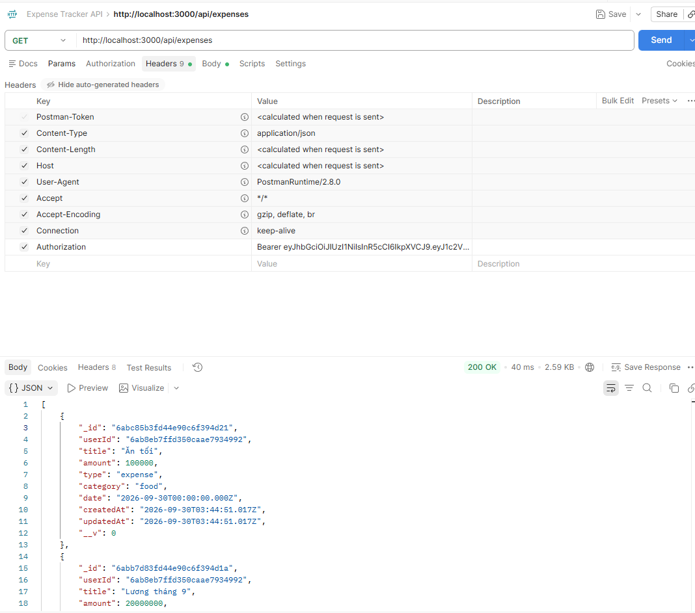

# Kiểm thử ứng dụng local bằng Postman

## Mục tiêu

Kiểm tra các API của Expense Tracker trước khi triển khai lên AWS.

---

## 1. Health Check

Chạy Backend:

```bash
node server.js
```

Request:

```text
GET http://localhost:3000/api/health
```

Response:

```json
{
    "status": "ok"
}
```

---

## 2. Register

Request:

```text
POST http://localhost:3000/api/auth/register
```

Body:

```json
{
    "name": "Test User",
    "email": "test@example.com",
    "password": "123456"
}
```

---

## 3. Login

Request:

```text
POST http://localhost:3000/api/auth/login
```

Body:

```json
{
    "email": "test@example.com",
    "password": "123456"
}
```

Response:

```json
{
    "message": "Đăng nhập thành công",
    "token": "<TOKEN>",
    "user": {
        "id": "<USER_ID>",
        "name": "Test User",
        "email": "test@example.com"
    }
}
```

---

## 4. Create Expense

Request:

```text
POST http://localhost:3000/api/expenses
```

Header:

```text
Authorization: Bearer <TOKEN>
Content-Type: application/json
```

Body:

```json
{
    "title": "Ăn trưa",
    "amount": 50000,
    "type": "expense",
    "category": "Food",
    "date": "2026-09-27"
}
```

---

## 5. Get Expenses

Request:

```text
GET http://localhost:3000/api/expenses
```

Header:

```text
Authorization: Bearer <TOKEN>
```

---

## 6. Summary

Request:

```text
GET http://localhost:3000/api/expenses/summary
```

Header:

```text
Authorization: Bearer <TOKEN>
```

---

## 7. Category Statistics

Request:

```text
GET http://localhost:3000/api/expenses/summary/category
```

Header:

```text
Authorization: Bearer <TOKEN>
```

---

## 8. Update Expense

Request:

```text
PUT http://localhost:3000/api/expenses/<ID>
```

Body:

```json
{
    "title": "Ăn tối",
    "amount": 100000,
    "type": "expense",
    "category": "Food",
    "date": "2026-09-27"
}
```

---

## 9. Delete Expense

Request:

```text
DELETE http://localhost:3000/api/expenses/<ID>
```

Header:

```text
Authorization: Bearer <TOKEN>
```

---

## 10. Kiểm tra Authentication

Gọi API Expense không có token:

```text
GET http://localhost:3000/api/expenses
```

Response:

```text
401 Unauthorized
```

Sau khi thêm:

```text
Authorization: Bearer <TOKEN>
```

API có thể truy cập.

---

## 11. Kết quả

Các API chính được kiểm tra trên local trước khi triển khai:

```text
Health
Register
Login
Create
Read
Update
Delete
Summary
Category Statistics
Authentication
```