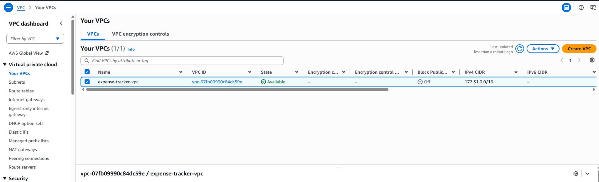
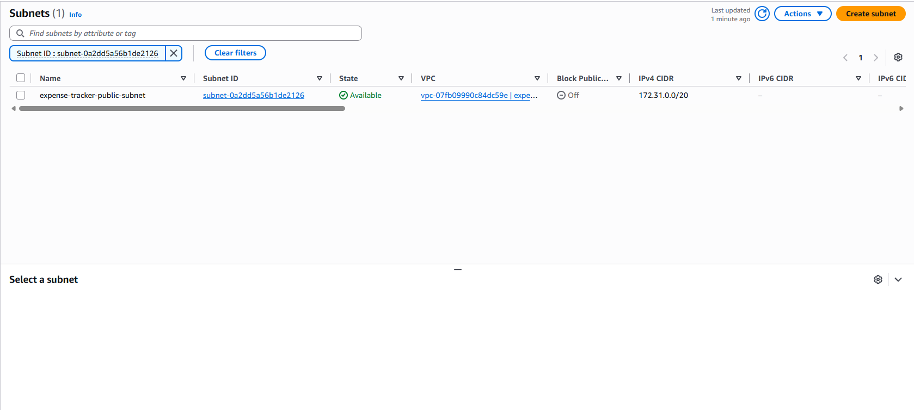
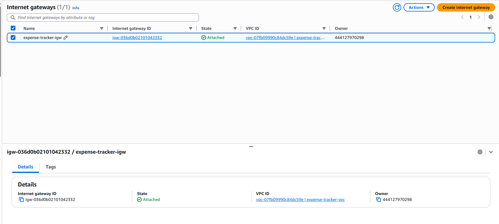

# Tạo AWS Account, IAM và Network

## Mục tiêu

Chuẩn bị môi trường AWS cho EC2 và các dịch vụ liên quan.

---

## 1. Region

Region sử dụng:

```text
Singapore   ap-southeast-1
```

---

## 2. IAM

IAM được sử dụng để quản lý quyền truy cập các tài nguyên AWS.

Các dịch vụ sử dụng trong Workshop:

```text
EC2
VPC
Lambda
EventBridge
CloudWatch
IAM
```

Project không sử dụng CloudTrail.

---

## 3. Tạo VPC



Thông tin:

```text
Name: expense-tracker-vpc
IPv4 CIDR: 10.0.0.0/16
```

---

## 4. Public Subnet

Tạo Subnet:

```text
Name: expense-tracker-public-subnet
CIDR: 10.0.1.0/24
```

Subnet thuộc:

```text
expense-tracker-vpc
```

---

## 5. Internet Gateway

Tạo:

```text
expense-tracker-igw
```

Attach Internet Gateway vào:

```text
expense-tracker-vpc
```

---

## 6. Route Table

Tạo Route Table cho Public Subnet.

Route:

```text
Destination: 0.0.0.0/0
Target: Internet Gateway
```

Associate Route Table với Public Subnet.

---

## 7. Security Group

Tạo:

```text
expense-tracker-sg
```

Inbound Rules:

| Type | Port | Purpose |
|---|---:|---|
| SSH | 22 | Kết nối EC2 |
| Custom TCP | 3000 | Node.js |

---

## 8. Mô hình Network

```text
Internet
    │
    ▼
Internet Gateway
    │
    ▼
VPC
    │
    ▼
Public Subnet
    │
    ▼
EC2
    │
    ▼
Node.js :3000
```

---

## 9. Kết quả

Môi trường Network đã sẵn sàng để tạo EC2 và triển khai Backend.