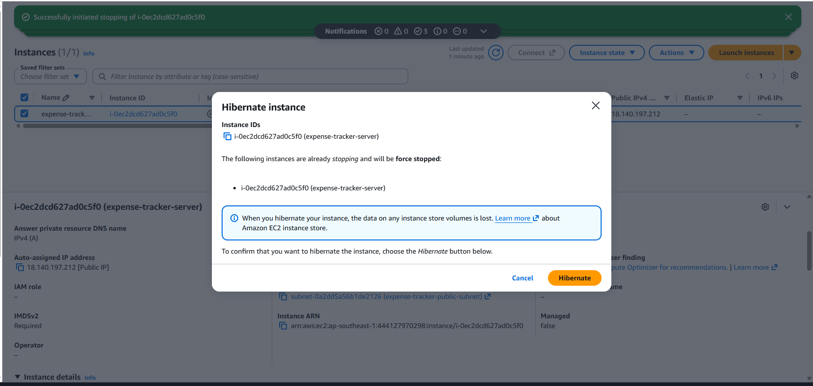
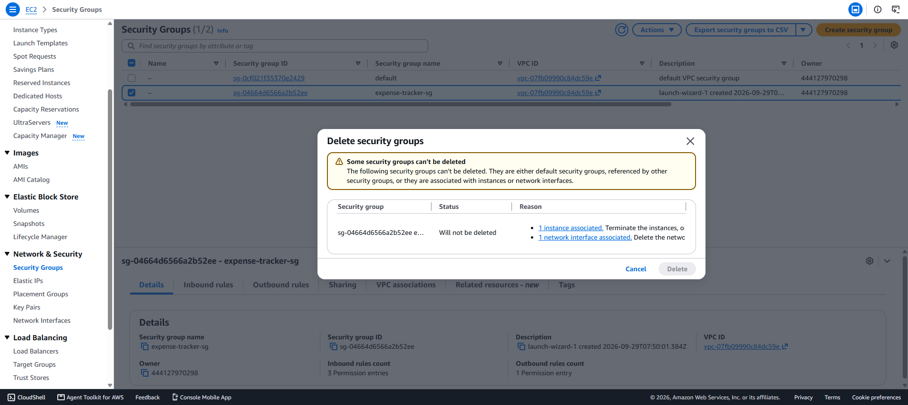
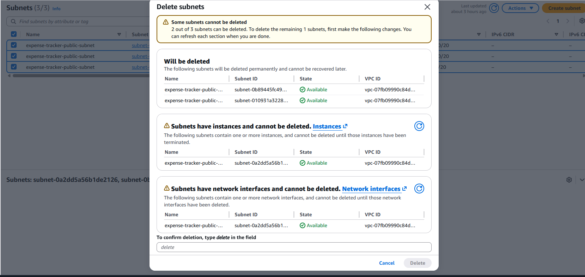
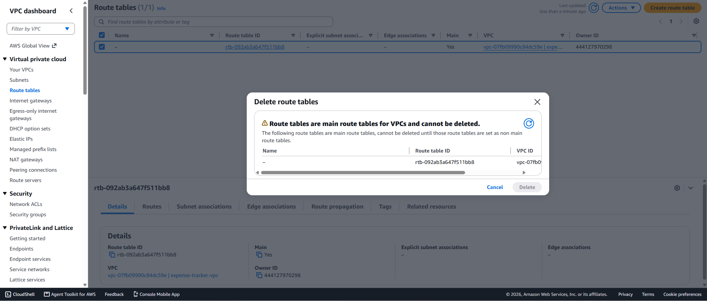
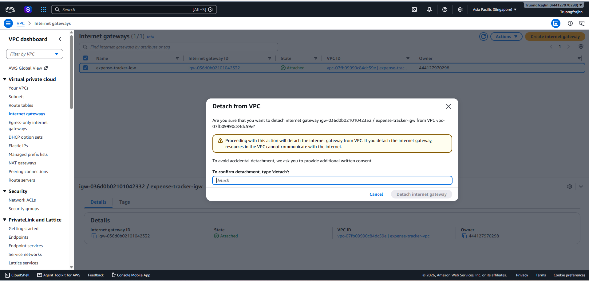
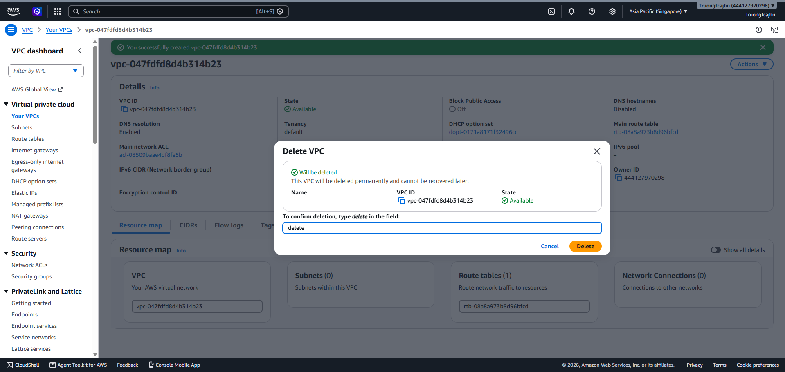
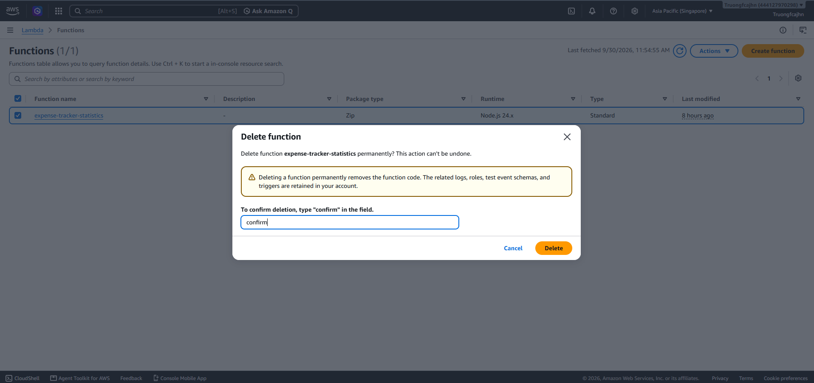
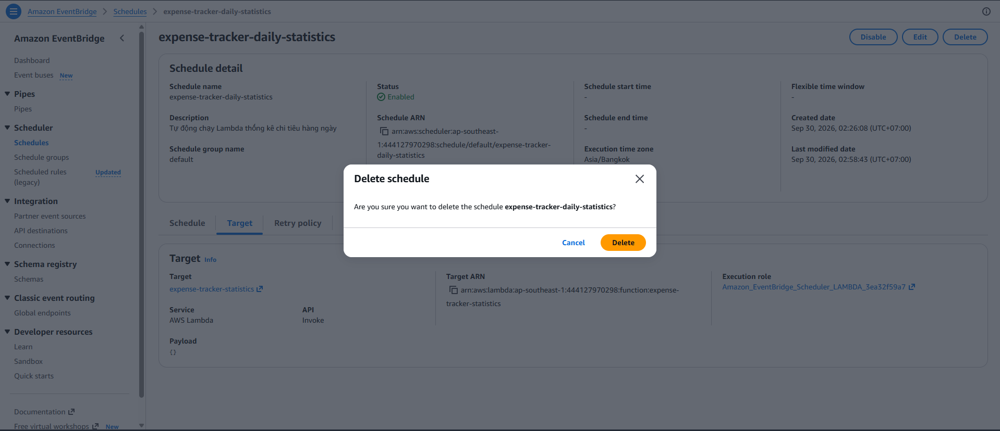
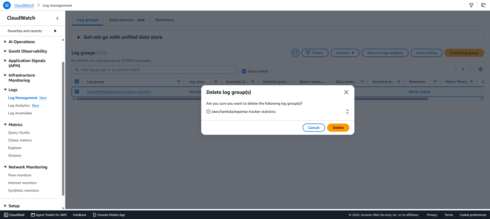

# Dọn dẹp tài nguyên

## Mục tiêu

Xóa các tài nguyên AWS không còn sử dụng sau khi hoàn thành Workshop.

Việc dọn dẹp giúp tránh duy trì các tài nguyên không cần thiết và hạn chế phát sinh chi phí.

---

## 1. Dừng và xóa EC2

Vào:

```text
AWS Console
→ EC2
→ Instances
```

Chọn Instance của Expense Tracker.

Thực hiện:

```text
Instance state
→ Terminate instance
```

Sau khi Terminate, kiểm tra Instance không còn ở trạng thái Running.

---

## 2. Xóa Security Group

Vào:

```text
AWS Console
→ EC2
→ Security Groups
```

Chọn:

```text
expense-tracker-sg
```

Xóa Security Group sau khi EC2 đã được Terminate.

---

## 3. Xóa Public Subnet

Vào:

```text
AWS Console
→ VPC
→ Subnets
```

Chọn:

```text
expense-tracker-public-subnet
```

Thực hiện:

```text
Delete subnet
```

---

## 4. Xóa Route Table

Vào:

```text
AWS Console
→ VPC
→ Route Tables
```

Chọn Route Table được tạo cho Expense Tracker.

Xóa Route Table sau khi Subnet đã được xóa hoặc không còn Association.

---

## 5. Detach và xóa Internet Gateway

Vào:

```text
AWS Console
→ VPC
→ Internet Gateways
```

Chọn:

```text
expense-tracker-igw
```

Thực hiện:

```text
Detach from VPC
```

Sau đó:

```text
Delete Internet Gateway
```

---

## 6. Xóa VPC

Vào:

```text
AWS Console
→ VPC
→ Your VPCs
```

Chọn:

```text
expense-tracker-vpc
```

Thực hiện:

```text
Delete VPC
```

Chỉ thực hiện bước này sau khi các tài nguyên phụ thuộc đã được xóa.

---

## 7. Xóa Lambda

Vào:

```text
AWS Console
→ Lambda
→ Functions
```

Chọn:

```text
expense-tracker-statistics
```

Thực hiện:

```text
Actions
→ Delete function
```

Xác nhận xóa Function.

---

## 8. Xóa EventBridge Scheduler

Vào:

```text
AWS Console
→ EventBridge
→ Scheduler
```

Chọn:

```text
expense-tracker-daily-statistics
```

Thực hiện:

```text
Delete
```

Xác nhận xóa Scheduler.

---

## 9. Xóa CloudWatch Logs

Vào:

```text
AWS Console
→ CloudWatch
→ Logs
→ Log groups
```

Chọn:

```text
/aws/lambda/expense-tracker-statistics
```

Thực hiện:

```text
Delete
```

---

## 10. Kiểm tra IAM

Kiểm tra các User, Group hoặc Policy được tạo riêng cho Workshop.

Nếu không còn sử dụng, có thể xóa các tài nguyên IAM tương ứng.

Không xóa tài khoản hoặc quyền IAM đang được sử dụng cho các hệ thống khác.

---


## 11. Kiểm tra tài nguyên AWS

Sau khi hoàn thành việc dọn dẹp, kiểm tra lại:

```text
EC2
VPC
Subnet
Internet Gateway
Security Group
Lambda
EventBridge Scheduler
CloudWatch Logs
IAM
```

Đảm bảo các tài nguyên không còn sử dụng đã được xử lý.

---

## 12. Kết quả

Các tài nguyên AWS được tạo trong Workshop đã được kiểm tra và dọn dẹp sau khi hoàn thành.

Các tài nguyên cần giữ lại cho mục đích phát triển có thể được giữ nguyên, đặc biệt là MongoDB Atlas Database nếu ứng dụng tiếp tục được sử dụng.